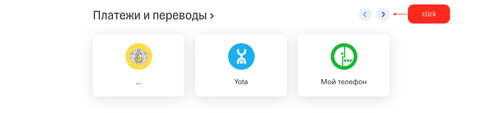

# Домашнее задание к занятию «1.2. Нереляционные базы данных - MongoDB»

В качестве результата пришлите ссылки на ваши GitHub-проекты в личном кабинете студента на сайте [netology.ru](https://netology.ru).

Все задачи этого занятия можно делать в **разных репозиториях**.

**Важно**: если у вас что-то не получилось, то оформляйте Issue [по установленным правилам](../report-requirements.md).

**ВАЖНО**: НИ В КОЕМ СЛУЧАЕ НЕ ПОДСТАВЛЯЙТЕ ДАННЫЕ СВОИХ РЕАЛЬНЫХ КАРТ В КОД! Это очень частая "оплошность", когда разработчики случайно коммитят и заливают на GitHub "чувствительные" (sensitive) данные (ключи, логины, пароли, адреса и т.д.). Используйте генераторы вроде: https://www.freeformatter.com/credit-card-number-generator-validator.html

Если вы всё же "случайно" залили чувствительные данные на GitHub, то используйте [инструкцию по удалению данных](https://help.github.com/en/github/authenticating-to-github/removing-sensitive-data-from-a-repository). Кроме того, как бы это печально не было, рекомендуем вам заблокировать карту и заказать в банке новую.

## Как сдавать задачи

1. Создайте на вашем компьютере Go-модуль (см. доп.видео к первой лекции)
1. Добавьте в него в качестве зависимостей pgx v4
1. Инициализируйте в нём пустой Git-репозиторий
1. Добавьте в него готовый файл [.gitignore](../.gitignore)
1. Добавьте в этот же каталог остальные необходимые файлы (убедитесь, что они аккуратно разложены по пакетам)
1. Сделайте необходимые коммиты
1. Создайте публичный репозиторий на GitHub и свяжите свой локальный репозиторий с удалённым
1. Сделайте пуш (удостоверьтесь, что ваш код появился на GitHub)
1. Ссылку на ваш проект отправьте в личном кабинете на сайте [netology.ru](https://netology.ru)
1. Задачи, отмеченные, как необязательные, можно не сдавать, это не повлияет на получение зачета (в этом ДЗ все задачи являются обязательными)

## Задача №1 - Платежи и переводы

### Задача

Достаточно часто банки выносят самые частые платежи и предсказания (будем считать, что это работает Machine Learning) в панель быстрого доступа.

Пример того, как это может выглядеть:

Второй скриншот - это тот же виджет, но "прокрученный" на один экран (выполнен клик на стрелку вправо - см.первый скриншот).

Скриншоты традиционны взяты из Интернет Банка Тинькофф.

Допущения: в рамках данной задачи мы будем считать, что в виджет вынесены именно самые частые операции, подсчитанные на основании статистики, + предсказанные операции (в реальности это может быть не так).

Что здесь интересно:
1. Здесь не только платежи, которые совершал пользователь, но и типовые операции (см. второй скриншот)
1. Чтобы собрать такую статистику, нужно сделать большой агрегирующий запрос

Если с первым пунктом всё ок, то со вторым есть небольшие сложности: если все транзакции пользователей хранятся в одной табличке, то такой запрос будет **очень долгим**. Поэтому обычно эта информация не рассчитывается при каждой загрузке страницы, а сохраняется на какое-то время и пересчитывается исходя из определённых событий (новый месяц, совершённый платёж и т.д.)

В связи с этим было принято решение сделать следующее: вынести хранение этих данных для каждого пользователя в отдельную базу (MongoDB) и там хранить в виде одной сущности (т.е. один пользователь - один документ в коллекции).

Что содержит документ:
* идентификатор пользователя
* список платежей и переводов (далее - элемент)

Что содержит каждый элемент документа:
* Ссылку на иконку
* Текст (название)
* Ссылку

Что вам нужно сделать:
1. Создать пустой проект
1. Добавить `docker-compose.yml` для поднятия MongoDB
1. `schema.js` (или `00-schema.js`) для создания пользователя в MongoDB и коллекции
1. `data.js` (или `01-data.js`) для вставки пары записей (как минимум одной, которая бы описывала представленную на скриншоте ситуацию)
1. Создать каталог `examples/queries`, в котором разместить примеры запросов для:
* получения документа по идентификатору пользователя (идентификатор пользователя будет просто целым числом из SQL-базы, не `_id` из MongoDB)
* добавления в документ нового элемента в определённую позицию
* удаления из документа элемента по определённой позицию

В качестве результата пришлите ссылку на ваш GitHub проект, в котором реализованы описанные выше требования.

## Задача №2 - Рестораны

**Важно**: это не обязательная задача, её выполнение не влияет на получение зачёта.

### Задача

На лекции мы рассматривали пример с фильмами. Сейчас же нас интересует хранение ресторанов.

Возьмём для примера два: [Ресторан Коптильня](https://www.tinkoff.ru/entertainment/moskva/restaurant-100012620/) и [Ресторан Северяне](https://www.tinkoff.ru/entertainment/moskva/restaurant-100000103/).

Примечание: если по каким-то причинам они не доступны на сайте, мы сохранили полные скриншоты страниц: [Ресторан Коптильня](pic/restaurant01.png) и [Ресторан Северяне](pic/restaurant02.png).

Что нужно сделать: нужно спроектировать коллекцию и сами документы для хранения всей информации, представленной на страницах (или скриншотах) в виде одного документа.

В рамках проекта должно быть:
1. `docker-compose.yml` для поднятия MongoDB
1. `schema.js` (или `00-schema.js`) для создания пользователя в MongoDB и коллекции
1. `data.js` для вставки двух документов, описывающих данные с указанных страниц

### Результат

В качестве результата пришлите ссылку на ваш GitHub проект, в котором реализованы описанные выше требования.
