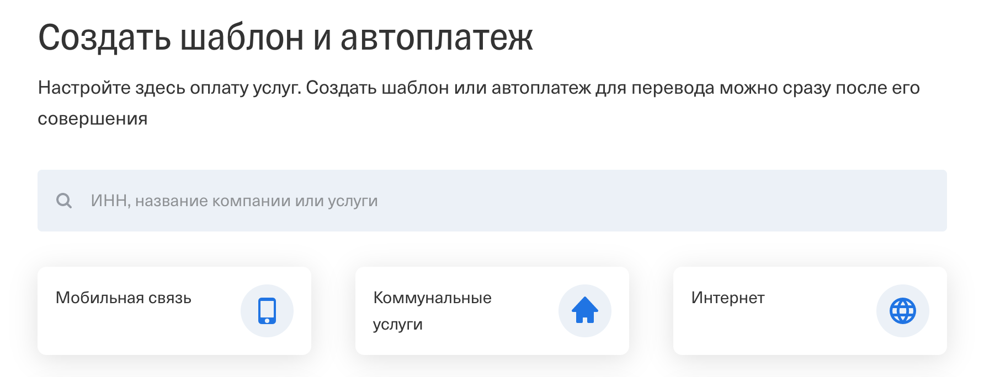
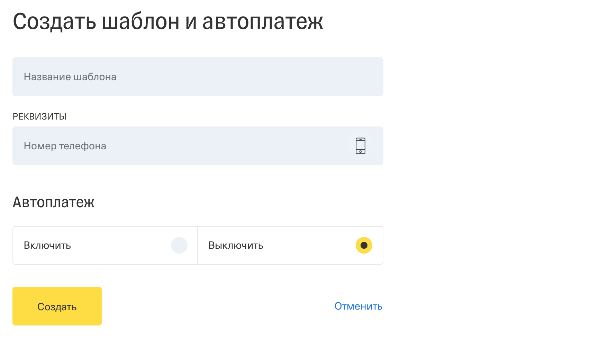
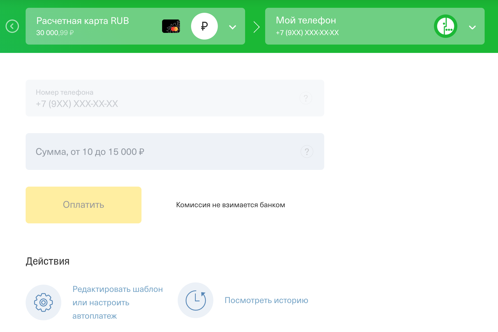

# Домашнее задание к занятию «2.3 gRPC (часть 1)»

Все задачи этого занятия нужно делать в **разных репозиториях**.

В качестве результата пришлите ссылки на ваши GitHub-проекты через личный кабинет студента на сайте [netology.ru](https://netology.ru).

**Важно**: если у вас что-то не получилось, то оформляйте Issue [по установленным правилам](../report-requirements.md).

**ВАЖНО**: НИ В КОЕМ СЛУЧАЕ НЕ ПОДСТАВЛЯЙТЕ ДАННЫЕ СВОИХ РЕАЛЬНЫХ КАРТ В КОД! Это очень частая "оплошность": разработчики случайно коммитят и заливают на GitHub "чувствительные" (sensitive) данные (ключи, логины, пароли, адреса и т.д.). Используйте генераторы вроде: https://www.freeformatter.com/credit-card-number-generator-validator.html

Если вы всё же "случайно" залили чувствительные данные на GitHub, то используйте [инструкцию по удалению данных](https://help.github.com/en/github/authenticating-to-github/removing-sensitive-data-from-a-repository). Кроме того, как бы это печально ни было, рекомендуем вам заблокировать карту и заказать в банке новую.

## Как сдавать задачи

1. Создайте на вашем компьютере Go-модуль (см. доп.видео к первой лекции).
1. Добавьте в него в качестве зависимостей pgx и всё, что нужно для создания gRPC сервера и клиента.
1. Инициализируйте в нём пустой Git-репозиторий.
1. Добавьте в него готовый файл [.gitignore](../.gitignore).
1. Добавьте в этот же каталог остальные необходимые файлы (убедитесь, что они аккуратно разложены по пакетам).
1. Сделайте необходимые коммиты.
1. Создайте публичный репозиторий на GitHub и свяжите свой локальный репозиторий с удалённым.
1. Сделайте пуш (удостоверьтесь, что ваш код появился на GitHub).
1. Ссылку на ваш проект отправьте в личном кабинете на сайте [netology.ru](https://netology.ru).
1. Задачи, отмеченные как необязательные, можно не сдавать, это не повлияет на получение зачета (в этом ДЗ все задачи являются обязательными).

## Шаблоны платежей

### Легенда

Легенда

Банки часто предлагают пользователям создать шаблон для часто совершаемых платежей, чтобы ускорить процесс оплаты (и зачастую упростить, т.к. упрощается процедура подтверждения платежа с точки зрения безопасности).

Например, в Интернет Банке Тинькофф это организовано так:

1\. Выбор типа шаблона

2\. Создание автоплатежа (для примера, пополнение счёта моб.телефона)

3\. Работа с автоплатежом:

### Задача

Реализуйте gRPC-сервер и gRPC-клиент в одном проекте (для них должны быть разные бинарники, формируемые из `cmd`), реализующие CRUD-функциональность для создания шаблона пополнения счёта моб.телефона.

То есть вам нужно сделать базовый CRUD:
* создание шаблона
* получение списка всех шаблонов
* получение шаблона по id
* редактирование
* удаление

О механизмах безопасности (идентификация, аутентификация и авторизация) можно не думать.

Шаблон автоплатежа пополнения счёта моб.телефона – сущность, у которой есть следующие поля:
* id
* название
* номер телефона
* дата создания
* дата обновления

Сами шаблоны должны храниться в БД PostgreSQL.

**Важно**: главное в этом ДЗ – научиться формировать .proto-файлы и генерировать сервер и клиент. Бизнес-логику (как хранить другие возможные автоплатежи в БД) принимать во внимание не нужно.

Итого:
1. Вы пишете `.proto`-файлы, описывающие требуемые CRUD-операции, типы сообщений – на ваше усмотрение.
1. Вы генерируете на основании `.proto` файлы `*.pb.go`, содержащие интерфейсы для клиента и сервера (всё как на лекции).
1. Вы пишете реализацию сервера – `cmd/templates/server`.
1. Вы пишете реализацию клиента – `cmd/templates/client` с демонстрацией всех запросов:
    * создание
    * получение списка
    * получение по id
    * редактирование по id
    * удаление по id

Сгенерированные в результате работы `protoc`-файлы также должны присутствовать в Git-репозитории.

В качестве результата пришлите ссылку на ваш GitHub-проект, в котором реализованы описанные выше требования.
