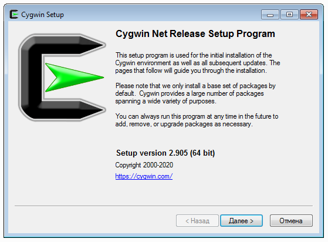
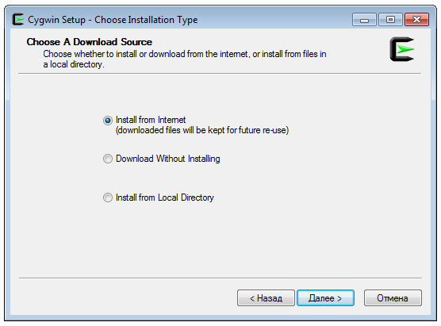
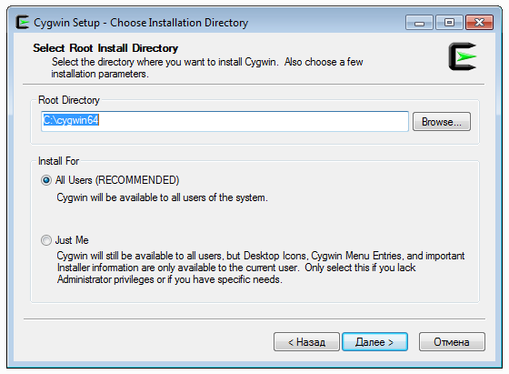
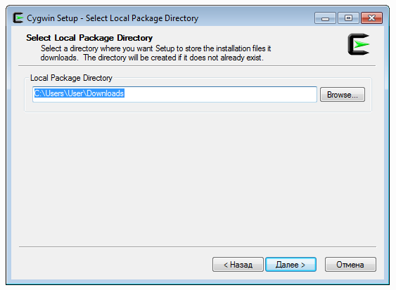
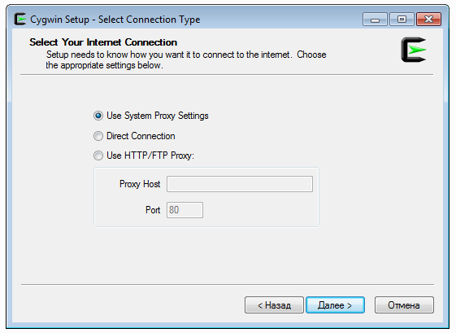
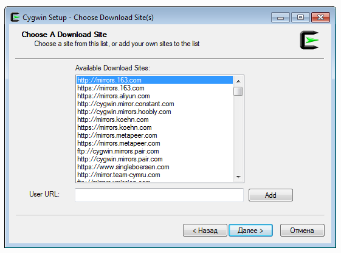
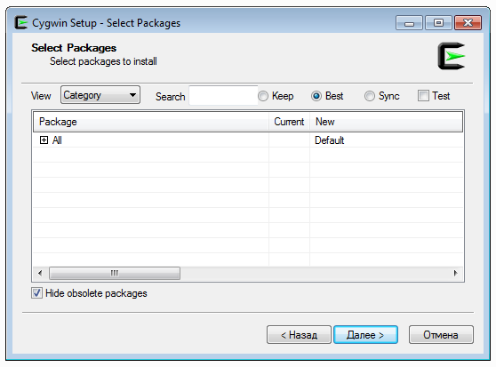
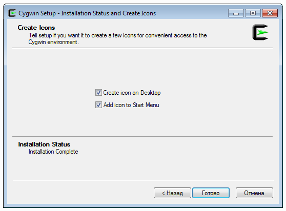
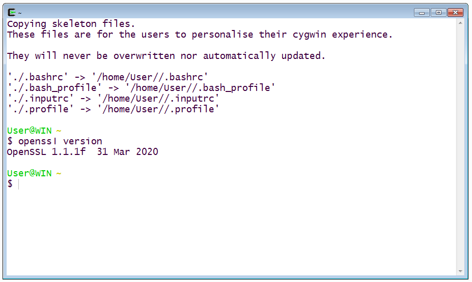

# OpenSSL

### Справка 

[OpenSSL](https://www.openssl.org/) - Open Source криптографическая библиотека.

[LibreSSL](https://www.libressl.org/) - форк (ответвление) от библиотеки OpenSSL, развиваемое в рамках проекта OpenBSD.

### Установка

#### Windows

Пользователем Windows мы предлагаем воспользоваться возможностями проекта [Cygwin](https://www.cygwin.com), который предоставляет набор инструментов из мира Linux для ОС Windows.

<details>
<summary>Инструкция по установке</summary>

##### Шаг 0. Перейдите на главную страницу и скачайте установочный файл:


##### Шаг 1. После чего запустите его на установку и нажмите на кнопку Далее:



##### Шаг 2. Оставьте значение по умолчанию (Install from Internet) и нажмите на кнопку Далее:



##### Шаг 3. Оставьте значения по умолчанию и нажмите на кнопку Далее:



##### Шаг 4. Оставьте значения по умолчанию и нажмите на кнопку Далее:



##### Шаг 5. Оставьте значения по умолчанию и нажмите на кнопку Далее:



##### Шаг 6. Выберите любой сервер из списка и нажмите на кнопку Далее:



##### Шаг 7. Оставьте значения по умолчанию и нажмите на кнопку Далее:



##### Шаг 8. Оставьте значения по умолчанию и нажмите на кнопку Готово:



##### Шаг 9. Откройте Cygwin Terminal через иконку на Рабочем Столе:


##### Шаг 10. Введите команду `openssl version` (можете продолжать работу):



По умолчанию вы будете находиться в каталоге `C:/cygwin64/home/<Имя вашего пользователя>`.

</details>

#### Linux

Для пользователей Linux (Ubuntu) необходимо выполнить в терминале команду: `openssl version`. Если в результате вы видите вывод вроде `OpenSSL 1.1.1f  31 Mar 2020` (версия и дата могут отличаться) а не `Command 'openssl' not found`, тогда вам не нужно ничего устанавливать.

Если же вы получили сообщение о том, что команда `openssl` не найдена, выполните следующую команду: `sudo apt-get install openssl`.

#### Mac OS

Для пользователей Mac необходимо выполнить в терминале команду: `openssl version`. Если в результате вы видите вывод вроде `LibreSSL 2.8.3` (версия может отличаться) а не `Command 'openssl' not found`, тогда вам не нужно ничего устанавливать.

Если же вы получили сообщение о том, что команда `openssl` не найдена, выполните следующую команду: `brew install openssl`.

### Инструкция 

Запустите терминал и начнём знакомиться с OpenSSL (LibreSSL):

1\. Справка по основным командам OpenSSL

```shell script
openssl help
```

2\. Справка по конкретной команде:

```shell script
openssl help req
```

Более детальную справку вы можете найти по адресу: https://www.openssl.org/docs/manmaster/man1/
